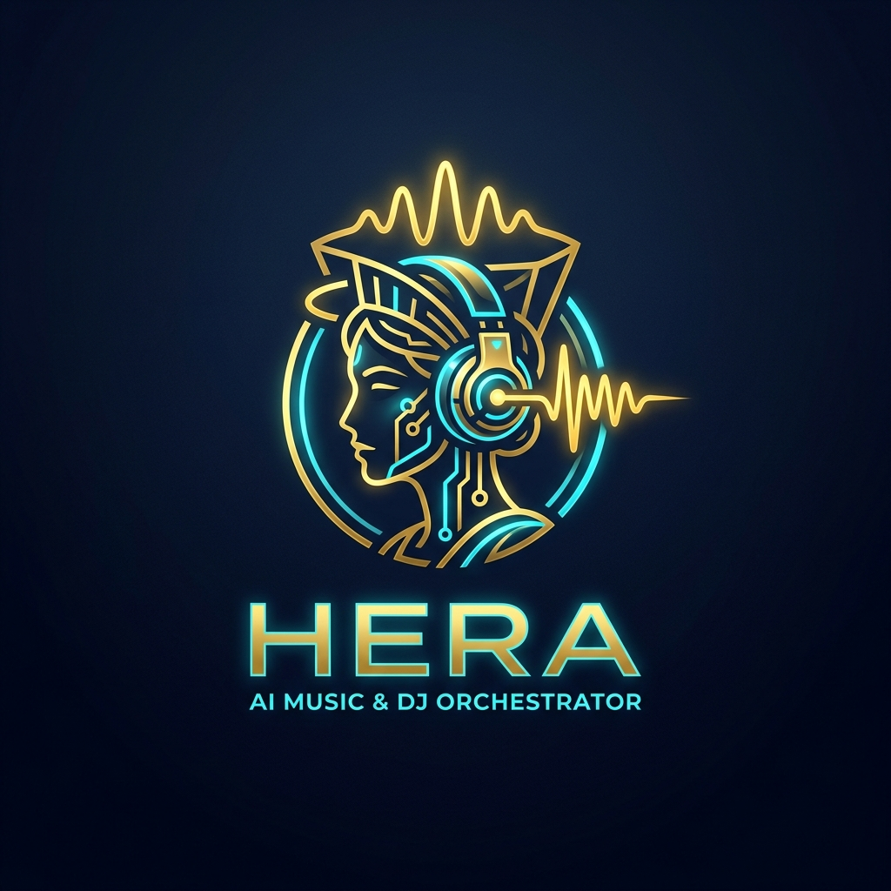

# ✨ El Manifiesto de HERA
### *«Todo es posible si lo imaginas: De la intención musical al booth del DJ en segundos»*

<div align="center">
  
  <p><i>La tecnología no existe para reemplazar la creatividad humana, sino para derribar cada barrera entre lo que sueñas y lo que puedes crear.</i></p>
</div>

---

## 🌌 1. La Chispa: Por qué existe HERA

Durante décadas, el arte de la selección musical y el DJing ha estado atrapado en la **fricción técnica**:
- Horas interminables buscando versiones originales y masters en calidad lossless.
- Cálculo manual o software privativo para detectar BPM, tonalidades armónicas y niveles de energía.
- Etiquetado tedioso de metadatos (ID3v2, Vorbis Comments, Camelot Wheel).
- Bases de datos cerradas y propietarias que secuestran tus playlists y te atan a un ecosistema.

**HERA nació con una convicción innegociable:**  
> **Si tienes una visión musical en tu mente, la tecnología debe ser capaz de materializarla de forma autónoma, limpia y soberana.**

HERA no es simplemente un script ni un cliente de descargas: es un **Super-Agente de Inteligencia Acústica Local**. Es la demostración tangible de que, cuando combinas la imaginación con agentes de IA autónomos y arquitectura local-first, **no hay límite para lo que puedes construir**.

---

## 🏛️ 2. Los 5 Pilares de HERA

```
       ┌─────────────────────────────────────────────────────────┐
       │                 TODO ES POSIBLE SI LO IMAGINAS          │
       └────────────────────────────┬────────────────────────────┘
                                    │
    ┌────────────────┬──────────────┴───────────────┬────────────────┐
    ▼                ▼                              ▼                ▼
[ 1. Calidad ]  [ 2. Local-First ]         [ 3. Dualidad ]   [ 4. Soberanía ]
  Cero audio      100% privado,              Humanos y         Tus archivos,
  sintético o     sin suscripciones          Agentes en        tus tags,
  placeholders    ni nubes obligatorias      armonía           tu libertad
```

### 1. Calidad Real — Cero Placeholders
En un mundo saturado de "placeholders" sintéticos y demos ruidosas, HERA solo acepta **audio real de grado estudio** (FLAC lossless o MP3 a 320 kbps verificados). Cada archivo es analizado rigurosamente con DSP (`librosa`, `ffmpeg`, `chromaprint`) antes de tocar tu biblioteca.

### 2. Soberanía Local-First
Tu música y tus datos te pertenecen. HERA corre en tu máquina, tu servidor doméstico o tu laptop para bolos. No requiere suscripciones mensuales de IA, no envía tus preferencias a corporaciones y funciona a la perfección incluso sin conexión a Internet.

### 3. Armonía entre Humanos y Agentes de IA
HERA está diseñado con una arquitectura **dual**:
- **Para Humanos:** Un CLI intuitivo, un Web UI visual y herramientas de 1 clic para subir a la nube o exportar a memorias USB para CDJs.
- **Para Agentes:** Un servidor estándar **Model Context Protocol (MCP)** y contratos tipados Pydantic para que modelos como Gemini, Claude, Codex y Ollama razonen y operen como curadores expertos.

### 4. Determinismo y Confianza
La IA propone y planifica; los motores tipados validan, aíslan en cuarentena y ejecutan. Nunca habrá sobrescrituras silenciosas, nunca habrá corrupción de metadatos, y nunca se transferirá un activo sin una base de autorización clara.

### 5. Democratización de la Excelencia Musical
Cualquier persona con pasión y curiosidad puede ahora tener el poder de un equipo de ingenieros de sonido, archivistas musicales y tour managers en una sola terminal.

---

## 🎧 3. El Flujo de la Imaginación

¿Cómo se ve *"hacerlo todo si lo imaginas"* en la práctica?

```text
1. IMAGINAS        ───>  "Quiero un set de French Touch y Deep House a 124 BPM
                         que empiece suave y termine en euforia pura."
                           │
2. HERA RAZONA     ───>  Identifica artistas, busca masters autorizados en P2P y local,
                         evalúa candidatos por calidad acústica y slot availability.
                           │
3. HERA VALIDA     ───>  Aísla en cuarentena, verifica integridad con FFmpeg,
                         calcula BPM exacto, escala Camelot (e.g. 8A -> 9A) y LUFS.
                           │
4. HERA CONSTRUYE  ───>  Inyecta tags ID3/FLAC nativos, genera el crate ordenado
                         y crea la guía visual _00_SET_GUIDE.txt.
                           │
5. DISFRUTAS       ───>  Sincroniza en 1 clic con tu Google Drive o tu USB de DJ.
                         Llegas al club, conectas tu pendrive y tocas.
```

---

## 🚀 4. Un Mensaje para la Comunidad de Creadores y Desarrolladores

Si estás leyendo esto, este repositorio es una invitación:

> No aceptes los límites del software empaquetado y privativo.  
> No te conformes con tareas manuales repetitivas que apagan tu chispa creadora.  
> **Usa agentes de IA, abraza el código abierto, construye local-first y haz realidad todo lo que imaginas.**

HERA es de código abierto bajo la licencia **MIT**. Está aquí para ser utilizado, extendido, transformado y disfrutado en pistas de baile y estudios de todo el planeta.

<div align="center">
  <br/>
  <b>🎧 HERA — Creado con pasión para los DJs, productores y visionarios del mundo.</b>
</div>
