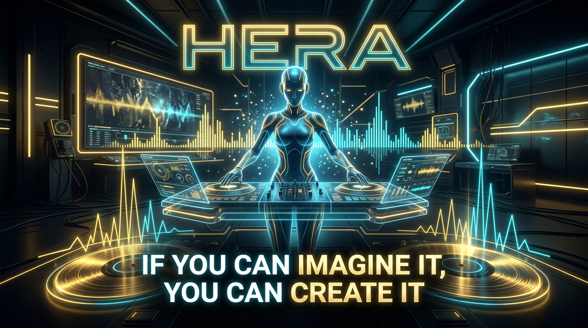

<div align="center">



# 🎧 HERA
### *The Autonomous, Local-First AI Super-Agent for DJs & Music Curators*

**«Todo es posible si lo imaginas: De la intención musical al booth del DJ en segundos»**

[](https://www.python.org/downloads/)
[](LICENSE)
[](https://modelcontextprotocol.io/)
[](https://rclone.org/)
[](AGENTS.md)
[](../../MANIFESTO.md)

<p align="center">
  <b>Hera</b> is an intelligent, cross-platform audio curation and asset orchestrator designed for real human DJs.<br/>
  It discovers studio-grade audio across authorized networks, executes deep acoustic & harmonic analysis (BPM, Camelot Wheel, LUFS), embeds native metadata tags, organizes physical DJ crates, and syncs seamlessly with Google Drive and cloud storage.
</p>

[✨ Read Manifesto](../../MANIFESTO.md) • [🤖 Agent Guide (AGENTS.md)](AGENTS.md) • [🚀 Quickstart](#-quickstart--installation) • [🎛️ CLI Reference](#️-cli-reference) • [📋 Roadmap](#-wishlist--roadmap-board-dj--human-centric)

---

</div>

## 📑 Table of Contents
- [✨ Core Philosophy](#-core-philosophy)
- [⚡ Key Features](#-key-features)
- [🏗️ System Architecture](#️-system-architecture)
- [🚀 Quickstart & Installation](#-quickstart--installation)
- [🎛️ CLI Reference](#️-cli-reference)
- [☁️ Cloud & Google Drive Sync](#️-cloud--google-drive-sync)
- [📋 Wishlist & Roadmap Board (DJ & Human-Centric)](#-wishlist--roadmap-board-dj--human-centric)
- [🤝 Contributing](#-contributing)
- [📄 License](#-license)

---

## ✨ Core Philosophy

* **100% Real Audio — Zero Synthetic Placeholders:** No synthetic tone generators or beep placeholders. Hera only promotes verified, full-length lossless FLAC and 320kbps MP3 master files to your library.
* **Human-Centric & DJ-First:** Built for the booth and the studio. All songs are organized into clean, human-readable folders with rich metadata (BPM, Key, Camelot) embedded directly inside the audio files.
* **Local-First & Cloud-Agnostic:** Runs entirely on your local machine, VPS, or Docker container with SQLite and stdio-based Model Context Protocol (MCP). No mandatory paid third-party AI subscriptions.
* **Cross-Platform Portability:** Operates identically on **Linux (x86_64, ARM64)**, **macOS**, and **Windows**.

---

## ⚡ Key Features

| Capability | Description |
|---|---|
| **P2P Federated Discovery** | Automated headless acquisition via Soulseek (`slskd`) with slot-availability prioritization. |
| **Acoustic & Harmonic DSP** | Precise extraction of tempo (**BPM**), harmonic key (**Camelot Wheel** notation, e.g. `8A`, `11B`), and loudness (**LUFS**) using `librosa` and `ffmpeg`. |
| **Native Tag Injection** | Automatically embeds standard **ID3v2.4** (MP3) and **Vorbis Comments** (FLAC) containing Title, Artist, Set/Album, BPM, InitialKey, and Track Numbers. |
| **Simple Crate Management** | Generates standalone set folders ready for any USB stick, media player, or DJ software without locked proprietary database formats. |
| **1-Click Multi-Cloud Sync** | Direct headless OAuth synchronization with **Google Drive**, **Cloudflare R2**, **Amazon S3**, and **Dropbox** powered by `rclone`. |
| **MCP AI Server Integration** | Exposes a full Model Context Protocol (MCP) server over `stdio` for seamless pair-programming with AI agents (Claude, Codex, Antigravity, Cursor). |

---

## 🔌 3 Ways to Use Hera

Hera is designed to work at every level — from a simple CLI tool to a full autonomous agent. **No LLM is required for modes 1 and 2.**

### Mode 1: CLI Toolkit (No LLM — For Humans)
Use Hera's tools directly from the terminal. Zero configuration, zero API keys.
```bash
hera library                                  # Show all tracks and sets
hera search "Daft Punk One More Time"         # Search & download from Soulseek
hera set "My Set" "Modjo" "Daft Punk"         # Build a DJ set from library
hera camelot 8A 128.0                         # Harmonic mixing recommendations
hera sync push                                # Upload sets to Google Drive
```

### Mode 2: MCP Skill (No LLM — For Any AI Agent)
Hera becomes a **skill/plugin** for any AI coding agent that supports MCP. The host agent (Antigravity, Claude, Cursor, OpenCode) provides the LLM brain — Hera provides the DJ tools.

```bash
# Start the MCP server
uv run hera serve
```

Connect from any MCP-compatible agent by adding to your MCP config:
```json
{
  "mcpServers": {
    "hera": {
      "command": "uv",
      "args": ["run", "--project", "/path/to/hera", "hera", "serve"],
      "transport": "stdio"
    }
  }
}
```

**Exposed MCP Tools:** `search_music`, `get_track_candidates`, `download_track`, `download_status`, `identify_track`, `analyze_track`, `organize_track`, `build_dj_crate`

### Mode 3: Autonomous Agent (Own LLM — Standalone)
Hera runs its own LLM via the [Antigravity SDK](https://github.com/google-antigravity/antigravity-sdk-python), with 12 supported backends. The LLM reasons about your natural language input and decides which tools to call.
```bash
hera chat                         # Auto-detect backend
hera chat -b ollama               # Use local Ollama
hera chat -b vertex               # Use Google Vertex AI
```

---

## 🏗️ System Architecture

```text
 outputs/hera/
 ├── bin/                    # Standalone auto-downloaded binaries (slskd, rclone, fpcalc)
 ├── config/                 # Configuration files (hera.toml, slskd.yml)
 ├── library/                # Canonical organized artist archive
 ├── sets/                   # Clean, human-friendly DJ Set folders
 │   ├── Set 1 - French Touch & Vocal House (2000-2005)/
 │   ├── Set 2 - Electro House & Peak-Time (2002-2005)/
 │   ├── Set 3 - Eurodance & Trance Anthems (2000-2005)/
 │   ├── Set 4 - House Divas & Club Classics/
 │   └── Sensation White Megamixes (2002-2006)/
 ├── src/hera/
 │   ├── adapters/           # Cloud storage (rclone), P2P (slskd)
 │   ├── agent/              # AI Agent (brain, backends, tools, prompts)
 │   ├── contracts/          # Pydantic schemas (Track, Crate, Job)
 │   ├── domain/             # Business logic (Config, Database, Export)
 │   ├── jobs/               # Asynchronous resilient job queue
 │   ├── mcp/                # MCP protocol tools & resource providers
 │   └── cli.py              # Turnkey Click CLI interface
 ├── tests/                  # Automated pytest suite
 └── hera.db                 # Lightweight local SQLite metadata store
```

---

## 🚀 Quickstart & Installation

Hera requires **Python 3.11+** and uses [`uv`](https://github.com/astral-sh/uv) for blazing-fast dependency resolution.

### 1. Clone Repository
```bash
git clone https://github.com/davidcastilloc/hera.git
cd hera
```

### 2. Turnkey Setup
Run the automated setup command. It will detect your operating system (**Linux**, **macOS**, or **Windows**), download the necessary standalone binaries (`slskd`, `fpcalc`, `rclone`), and initialize the SQLite database:
```bash
uv run hera setup
```

### 3. Verify System Health
```bash
uv run hera doctor
```
```text
[*] Running Hera health diagnostic...
[OK] Operating System: Linux / Windows / macOS
[OK] Python: 3.11+
[OK] SQLite Database: hera.db accessible
[OK] Binary ffmpeg: available
[OK] Binary ffprobe: available
[OK] Binary fpcalc: installed in bin/
[OK] Daemon Soulseek (slskd): installed in bin/
[OK] Cloud Engine (rclone): available (v1.69.1)
[OK] DSP Acoustic Engine (librosa): installed
[OK] Tagging Engine (mutagen): installed
[OK] MCP Python SDK: installed
[SUCCESS] All critical systems and tools are ready.
```

---

## 🎛️ CLI Reference

```bash
# General Setup and Diagnostics
uv run hera setup                  # Initialize directories, DB, and auto-download binaries
uv run hera doctor                 # Check health of all tools, engines, and remotes

# P2P Soulseek Daemon
uv run hera slskd                  # Start the local Soulseek daemon at http://localhost:5030

# Cloud & Google Drive Sync
uv run hera sync login             # 1-Click Direct OAuth web login for Google Drive
uv run hera sync status            # Check connection status and configured remotes
uv run hera sync push              # Upload & sync local sets/ to Google Drive (gdrive:Hera_Music/sets)
uv run hera sync pull              # Download sets from cloud to local machine
uv run hera sync config            # Advanced interactive assistant (S3, Cloudflare R2, Dropbox)

# AI Agent Server (MCP — for external agents)
uv run hera serve                  # Start Model Context Protocol (MCP) stdio server

# Standalone DJ Tools (No LLM Required)
uv run hera library                # Show inventory of all tracks and sets
uv run hera search "Artist Title"  # Search & download from Soulseek P2P
uv run hera set "Name" "track1"    # Build a DJ set from library tracks
uv run hera camelot 8A 128.0       # Harmonic mixing recommendations (Camelot Wheel)

# AI Conversational Agent (Multi-Backend)
uv run hera chat                   # Auto-detect best available backend
uv run hera chat -b ollama         # Use local Ollama
uv run hera chat -b vertex         # Use Google Vertex AI
uv run hera chat -b openai -m gpt-4o  # Use OpenAI GPT-4o
uv run hera chat -b lmstudio       # Use LM Studio desktop
uv run hera chat -b jan            # Use Jan desktop app
uv run hera chat -b llamacpp       # Use llama.cpp server
uv run hera chat -b anthropic      # Use Anthropic Claude
```

---

## 🧠 Supported AI Backends

Hera's AI agent supports **12 backends** — 4 cloud providers and 8 local engines. All connect through the [Google Antigravity SDK](https://github.com/google-antigravity/antigravity-sdk-python) with full tool calling support.

### Cloud Providers

| Backend | Flag | Env Var | Default Model |
|---------|------|---------|--------------|
| Google Gemini API | `--backend gemini` | `GEMINI_API_KEY` | `gemini-2.5-flash` |
| Google Vertex AI | `--backend vertex` | `VERTEX_PROJECT` | `gemini-2.5-flash` |
| OpenAI | `--backend openai` | `OPENAI_API_KEY` | `gpt-4o` |
| Anthropic Claude | `--backend anthropic` | `ANTHROPIC_API_KEY` | `claude-sonnet-4-20250514` |

### Local Engines (100% Free & Private)

| Backend | Flag | Default Port | Install |
|---------|------|-------------|---------|
| [Ollama](https://ollama.com) | `--backend ollama` | `11434` | `curl -fsSL https://ollama.com/install.sh \| sh` |
| [LM Studio](https://lmstudio.ai) | `--backend lmstudio` | `1234` | Desktop app download |
| [Jan](https://jan.ai) | `--backend jan` | `1337` | Desktop app download |
| [llama.cpp](https://github.com/ggerganov/llama.cpp) | `--backend llamacpp` | `8080` | Build from source |
| [vLLM](https://github.com/vllm-project/vllm) | `--backend vllm` | `8000` | `pip install vllm` |
| [LocalAI](https://localai.io) | `--backend localai` | `8080` | Docker / binary |
| [MLX](https://github.com/ml-explore/mlx) | `--backend mlx` | `8080` | `pip install mlx-lm` (Apple Silicon) |
| Custom | `--backend custom` | — | Any OpenAI-compatible endpoint |

### Auto-Detection

When no `--backend` flag is provided, Hera automatically detects the best available backend by checking environment variables and probing local ports. No configuration needed — just start your preferred engine and run `hera chat`.

---

## ☁️ Cloud & Google Drive Sync

Connecting your Google Drive is designed to be **100% human-friendly** without tedious manual JSON credentials or multi-step question prompts.

### 1-Click Direct OAuth
```bash
uv run hera sync login
```
1. Hera automatically opens your default web browser to the Google OAuth consent screen.
2. Select your Google account and click **"Allow"**.
3. The terminal instantly confirms authorization.

### Sync Local Sets to the Cloud
```bash
uv run hera sync push
```
All curated folders in `sets/` will be uploaded to `Hera_Music/sets` on your Google Drive, complete with all embedded BPM, Key, and Camelot tags.

---

## 📋 Wishlist & Roadmap Board (DJ & Human-Centric)

This board tracks upcoming features designed specifically to streamline live DJ performance, mobile accessibility, and team collaboration:

```text
========================================================================================
                                 HERA WISHLIST BOARD
========================================================================================

[ 📋 ] DJ Cue Sheet Generator (_00_SET_GUIDE.txt)
       Automatically generate an easy-to-read ASCII overview file in each set folder:
       - Displays track sequence, BPM progression, Camelot harmonic mix path, and energy.
       - Optimized for instant viewing on mobile phones in the DJ booth.

[ 📱 ] Terminal Mobile QR Code Fast-Access
       Upon completing `hera sync push`, display a scannable ASCII QR code in the terminal
       for instant opening of the Google Drive set folder on your phone or tablet.

[ 💾 ] 1-Click "Gig USB" Exporter (`hera sync to-usb E:`)
       Export selected sets directly to FAT32/exFAT USB drives with clean filesystem naming,
       omitting hidden OS metadata files that can cause playback stutter on Pioneer CDJs.

[ 🔄 ] Silent Background Auto-Sync (`auto_sync: true`)
       Automatically sync new sets to Google Drive in the background as soon as DSP
       validation finishes, sending a lightweight OS notification when ready.

[ 🤝 ] B2B Shared Crate Collaboration (`hera sync b2b <drive-folder-link>`)
       Allow two DJs playing Back-to-Back to drop tracks into a shared Google Drive folder;
       Hera downloads, analyzes, and arranges them into an optimal harmonic sequence.

[ 🎧 ] Lightweight Mobile Preview Streamer
       Optionally transcode sets to low-bitrate MP3 previews in a `_previews/` folder
       for quick, data-saving track previewing on mobile connections.
========================================================================================
```

---

## 🤝 Contributing

We welcome contributions from developers, DJs, and audio engineers! Please review [CONTRIBUTING.md](CONTRIBUTING.md) for detailed guidelines on:
- Setting up your local development environment with `uv`.
- Coding conventions, type annotations, and Pydantic domain models.
- Running automated test suites and linters (`pytest`, `ruff`, `mypy`).
- Submitting Pull Requests and Git commit conventions.

---

## 📄 License

Hera is licensed under the **MIT License**. See the [LICENSE](LICENSE) file for details.

<div align="center">
  <sub>Crafted for DJs, producers, and audio curators worldwide.</sub>
</div>
